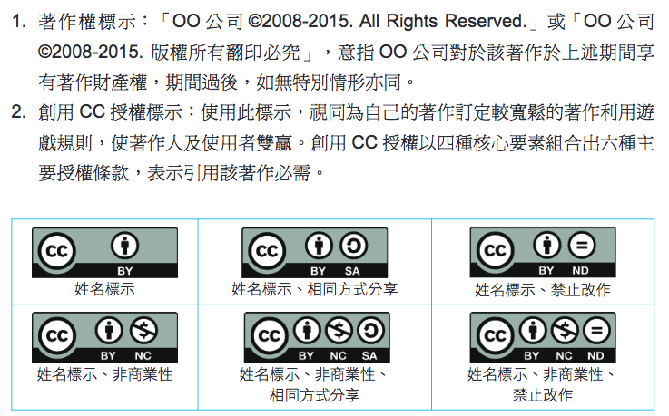

# 智慧財產權
- 智慧 財產 權
# what is 智慧財產?
# 智慧 → $$
- 以法律讓智慧產物享有財產的地位
# 鼓勵智慧產出
- 保障作者賺錢的權利
# 智慧財產\\⊇\\{商標, 專利, 著作}
- 營業秘密 植物種苗 積體電路...
# 文 、 圖
- 商標權
# 何嘉仁
# 
- 何嘉仁
# 長頸鹿 (?)
# 
- 長頸鹿
# 註冊 → 保護費
- 商標權
# 發明、\\新型、\\新式樣
- 專利權
# 註冊 → 保護費
- 專利權
# 各式創作
- 著作權
# 語文
- 各式創作
# 音樂
- 各式創作
# 戲劇舞蹈
- 各式創作
# 美術
- 各式創作
# 攝影
- 各式創作
# 圖形
- 各式創作
# 視聽
- 各式創作
# 錄音
- 各式創作
# 建築
- 各式創作
# 電腦程式
- 各式創作
# 不須註冊\\作品完成即受保護
- 著作權
# 保護作品之\\**表達**、**形式**\\not**過程**、**觀念**
# 
- 太陽
# 
- 也是太陽
# 所以
# 我做的
# 投影片
# 我拍的
# 微電影
# 我寫的
# 週記
# 我抄的
# 作業
# (?)
# 都
# 受到
# 著作權
# 保護
# 不用申請
# 自動生效
# ，
# 我
# 擁有
# 下列
# 權利
# 公開口述權
# 公開演出權
# 公開展示權
# 公開上映權
# 公開傳輸權
# 公開播送權
# 公開發表權
# 重製權
# 改作權
# 散布權
# 編輯權
# 出租權
# 
# 授權
# 
- 授權書
# 鼓勵創作
# 
- 創用CC (Creative Commons)
# 
- BY 姓名標示 (attribution)
# 
- NC 禁止商業用途 (non-commercial)
# 
- ND 禁止改作 (no-derivatives)
# 
- SA 相同方式分享 (share-alike)
# 
# 自由軟體
# 授權別人可以修改程式碼
# GPL
- 授權條款
# 通常是免費的
# firefox
# PCMan
# OpenShot
# 
# 剩下的
# 自己看
- <a href="http://ile.tp.edu.tw/source/H-E3/pdf/高中3版-09著作權合理使用.pdf">http://ile.tp.edu.tw/source/H-E3/pdf/高中3版-09著作權合理使用.pdf</a>
# 第5頁 之後
- 參、資訊山下定心猿 \\ 一、避免侵權，合法引用―生活中常見相關示例 \\ 二、謹守原則，合理使用―何謂著作權合理使用？ \\ 三、保護自己，尊重別人―避免侵權與誤觸罰則 \\ 肆、功成圓滿見真如-一、舉一反三 \\ 肆、功成圓滿見真如-四、參考答案
# 出一道選擇題
- 各組\\<a href="https://goo.gl/forms/a2pEGTlgqDsWvCrx2">https://goo.gl/forms/a2pEGTlgqDsWvCrx2</a>
